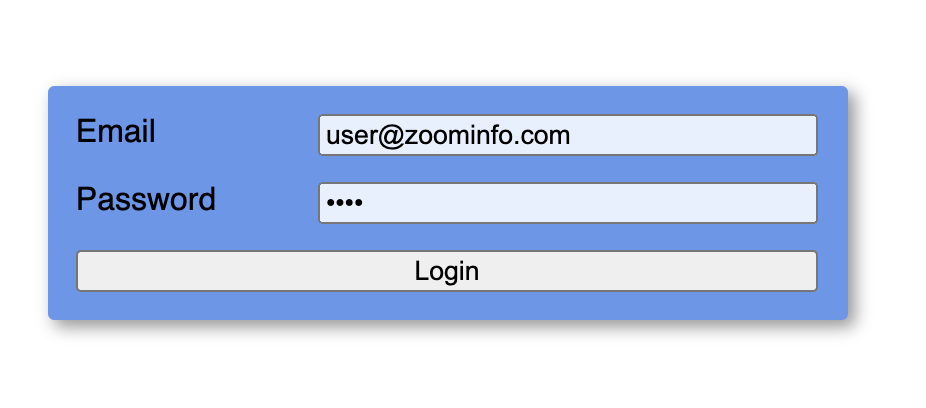
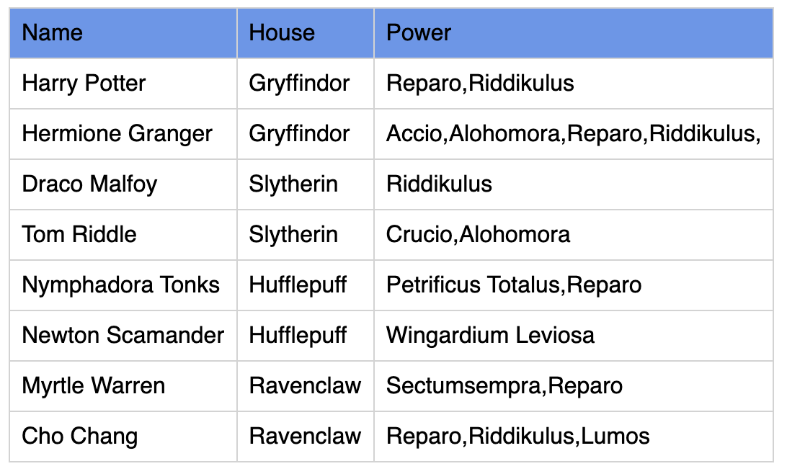

# bootcamp-2021
Welcome to Zoominfo Bootcamp Exam.

* The exam is up to 2 hours.
* No need to create new files or delete file, every change should be done in the existing source files.
* The only files relevant for the exam located in the `src` directory (both).


## Installation
```shell
git clone <.....>
```

## Tasks

### 0 Start backend application
1. Open terminal (command line)
2. Navigate to `server` directory
3. Run `npm i`
4. Run `npm start`
5. Fix the error displayed in the terminal

> Leave the server running during this exam. You'll need it. You can always re-run it.

### 1 Start frontend application
1. Open (another) terminal
2. Navigate to `client` directory
3. Run `npm i`
4. Run `npm start`
5. [Open your browser](http://localhost:4200)
6. Login form is missing, you have to implement it.


Requirements:
1. Email input
2. Password input
3. Login button
4. (validation) If inserted email is not valid, an error message should appear below the input.
5. (validation) If interested password length is less than 3 characters, an error message should appear below the input.
6. (validation) If email and password are not valid, login button should be disabled.

### 2 Login
The login is not working as expected. We get an error when clicking on `Login` button.

1. Fix the error.
2. Implement the `canLogin` function to make the end point work.


Login request should look like:
```shell
POST /login

{"email":"user@zoominfo.com","password":"zoominfo"}
```
Expected result from the `login` end point:
* login success:
```json
{ "token": "magic-token" }
```
* login fail:
```json
{ "token": "" }
```
User and password are always:
```typescript
const EMAIL = 'user@zoominfo.com';
const PASSWORD = 'zoominfo';
```

### 3 Magicians Table
After login, enter the magicians exercise.
1. The table should present a list of magicians.
2. The server returns an empty list.
3. All magicians detail exist in a CSV file located at `/server/data/data.csv`.

Read the CSV file and return all magicians from `/fetch` end point in the following format:
```json
[
   {
      "name": "Magician Name",
      "house": "Magician house",
      "power": ["power 1", "power 2"]
   },
   {
      "name": "Magician Name",
      "house": "Magician house",
      "power": ["power 1"]
   }
]
```
The table should look like:


### 4 Sorting Magicians

The `/fetch` end point should read query params crated by the `magician-filter` and sort the magician results before sending it to the client.

The request should look like:
```shell
/fetch?by=name&direction=up
```

Requirement:
1. Implement the sort mechanism in the server.
2. Implement the `reset` function in `magician-filter` component. It should reset the filter and fetch magician.
3. If one of the params is missing, skip sorting.
4. If `direction` is not `up` or `down`, skip sorting.
5. If `by` is not `name` or `house`, skip sorting.


### 5 Properties
Enter the properties exercise.

Your task is to implement the empty functions `atob` and `btoa` to move items from one column to the other.


### 6 Done
Compress into `zip` file the following directories *only*:
* `/client/src`
* `/server/src`

And send it to `ziv.perry@zoominfo.com`.


Good Luck!
